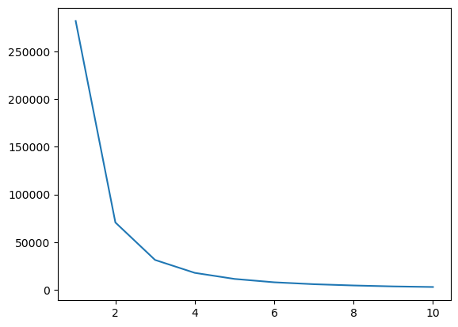
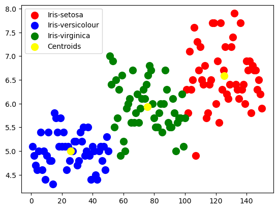

## 1-Importing Data and Exploring


```python
import numpy as np
import pandas as pd
import matplotlib.pyplot as plt

df = pd.read_csv('./Iris.csv')
df.head()
```


<div>
<style scoped>
    .dataframe tbody tr th:only-of-type {
        vertical-align: middle;
    }

    .dataframe tbody tr th {
        vertical-align: top;
    }

    .dataframe thead th {
        text-align: right;
    }
</style>
<table border="1" class="dataframe">
  <thead>
    <tr style="text-align: right;">
      <th></th>
      <th>Id</th>
      <th>SepalLengthCm</th>
      <th>SepalWidthCm</th>
      <th>PetalLengthCm</th>
      <th>PetalWidthCm</th>
      <th>Species</th>
    </tr>
  </thead>
  <tbody>
    <tr>
      <th>0</th>
      <td>1</td>
      <td>5.1</td>
      <td>3.5</td>
      <td>1.4</td>
      <td>0.2</td>
      <td>Iris-setosa</td>
    </tr>
    <tr>
      <th>1</th>
      <td>2</td>
      <td>4.9</td>
      <td>3.0</td>
      <td>1.4</td>
      <td>0.2</td>
      <td>Iris-setosa</td>
    </tr>
    <tr>
      <th>2</th>
      <td>3</td>
      <td>4.7</td>
      <td>3.2</td>
      <td>1.3</td>
      <td>0.2</td>
      <td>Iris-setosa</td>
    </tr>
    <tr>
      <th>3</th>
      <td>4</td>
      <td>4.6</td>
      <td>3.1</td>
      <td>1.5</td>
      <td>0.2</td>
      <td>Iris-setosa</td>
    </tr>
    <tr>
      <th>4</th>
      <td>5</td>
      <td>5.0</td>
      <td>3.6</td>
      <td>1.4</td>
      <td>0.2</td>
      <td>Iris-setosa</td>
    </tr>
  </tbody>
</table>
</div>


## 2- Elbow Method To Find Number of Clusters 


```python
from sklearn.cluster import KMeans

X = df.iloc[:,:-1]
y = df.iloc[:,-1]

wc = []

for i in range(1,11):
    km = KMeans(n_clusters=i,
                init='k-means++',
                max_iter=200,
                n_init=10,
                random_state=42
               )
    km.fit(X)
    wc.append(km.inertia_)
    
plt.plot(range(1,11), wc)
```


    [<matplotlib.lines.Line2D at 0x7fc7f8f1f9d0>]


    

    


> From Elbow method clusters num could be 3

## 3- Training The Model


```python
model = KMeans(
    n_clusters=3,
    init='k-means++',
    max_iter=200,
    n_init=10,
    random_state=42
)

y_predict = model.fit_predict(X)
```


```python
print(model.cluster_centers_)
y_predict
```

    [[125.5     6.588   2.974   5.552   2.026]
     [ 25.5     5.006   3.418   1.464   0.244]
     [ 75.5     5.936   2.77    4.26    1.326]]


    array([1, 1, 1, 1, 1, 1, 1, 1, 1, 1, 1, 1, 1, 1, 1, 1, 1, 1, 1, 1, 1, 1,
           1, 1, 1, 1, 1, 1, 1, 1, 1, 1, 1, 1, 1, 1, 1, 1, 1, 1, 1, 1, 1, 1,
           1, 1, 1, 1, 1, 1, 2, 2, 2, 2, 2, 2, 2, 2, 2, 2, 2, 2, 2, 2, 2, 2,
           2, 2, 2, 2, 2, 2, 2, 2, 2, 2, 2, 2, 2, 2, 2, 2, 2, 2, 2, 2, 2, 2,
           2, 2, 2, 2, 2, 2, 2, 2, 2, 2, 2, 2, 0, 0, 0, 0, 0, 0, 0, 0, 0, 0,
           0, 0, 0, 0, 0, 0, 0, 0, 0, 0, 0, 0, 0, 0, 0, 0, 0, 0, 0, 0, 0, 0,
           0, 0, 0, 0, 0, 0, 0, 0, 0, 0, 0, 0, 0, 0, 0, 0, 0, 0], dtype=int32)


## 4- Plotting The Clusters


```python
plt.scatter(X.iloc[y_predict == 0, 0], X.iloc[y_predict == 0, 1], 
            s = 100, c = 'red', label = 'Iris-setosa')
plt.scatter(X.iloc[y_predict == 1, 0], X.iloc[y_predict == 1, 1], 
            s = 100, c = 'blue', label = 'Iris-versicolour')
plt.scatter(X.iloc[y_predict == 2, 0], X.iloc[y_predict == 2, 1],
            s = 100, c = 'green', label = 'Iris-virginica')
plt.scatter(model.cluster_centers_[:, 0], model.cluster_centers_[:,1], 
            s = 100, c = 'yellow', label = 'Centroids')
plt.legend()
```


    <matplotlib.legend.Legend at 0x7fc84a38db50>


    

    

